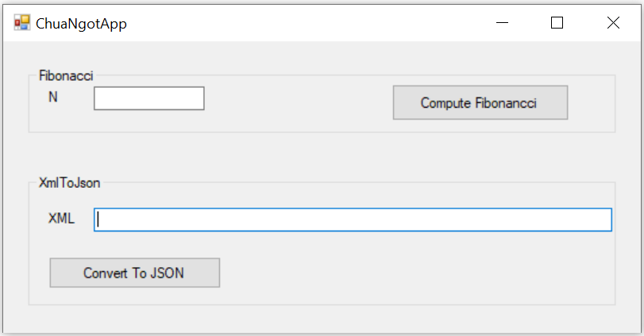
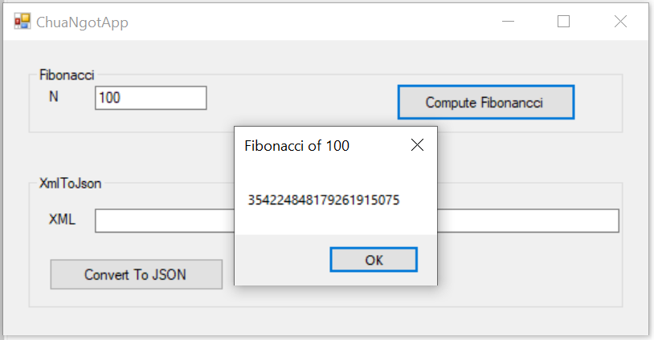
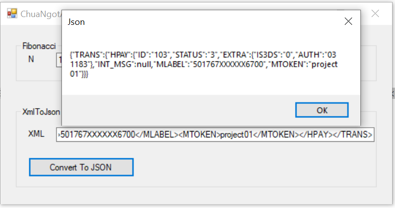

# ChanhDuongAPI
Challenge link: https://gist.github.com/lemonway/4a2a22949e96863769ce91185bfc2f43#file-webservice_challenge-md
There are 2 projects in this repos.
# 1. ChanhDuongAPI
This is the SOAP webservice which have **Fibonacci service** and **XmlToJson service**. I built the simple Webservice, there is not yet authentification.
For testing, you can run the Webservice on `localhost` and use Postman for sending requests. 
## Fibonacci service
Method: POST 

URL: https://localhost:44382/ChuaNgotService.asmx 

Body:
```
<soap:Envelope xmlns:xsi="http://www.w3.org/2001/XMLSchema-instance" xmlns:xsd="http://www.w3.org/2001/XMLSchema" xmlns:soap="http://schemas.xmlsoap.org/soap/envelope/">
  <soap:Body>
    <Fibonacci xmlns="http://chanhduong.org/">
      <n>100</n>
    </Fibonacci>
  </soap:Body>
</soap:Envelope>
```
## XmlToJson service
Method: POST 

URL: https://localhost:44382/ChuaNgotService.asmx 

Body:
```
<?xml version="1.0" encoding="utf-8"?>
<soap:Envelope xmlns:xsi="http://www.w3.org/2001/XMLSchema-instance" xmlns:xsd="http://www.w3.org/2001/XMLSchema" xmlns:soap="http://schemas.xmlsoap.org/soap/envelope/">
  <soap:Body>
    <XmlToJson xmlns="http://chanhduong.org/">
      <xml>&lt;TRANS>&lt;HPAY>&lt;ID>103&lt;/ID>&lt;STATUS>3&lt;/STATUS>&lt;EXTRA>&lt;IS3DS>0&lt;/IS3DS>&lt;AUTH>031183&lt;/AUTH>&lt;/EXTRA>&lt;INT_MSG/>&lt;MLABEL>501767XXXXXX6700&lt;/MLABEL>&lt;MTOKEN>project01&lt;/MTOKEN>&lt;/HPAY>&lt;/TRANS></xml>
    </XmlToJson>
  </soap:Body>
</soap:Envelope>
```
# 2. ChanhDuongAPI.Tests
This is a project "Class Library" for testing these functions in ChanhDuongAPI by using XUnit.

We can run the test in console with the command below:

```
packages\xunit.runner.console.2.3.1\tools\net452\xunit.console.exe ChanhDuongAPI.Tests\bin\Debug\ChanhDuongAPI.Tests.dll
```

# 3. ChanhDuongApiConsumer
This is an Application Console for consuming the webservices in ChanhDuongAPI.
For checking this application, there are 3 steps:
1. Build ChanhDuongApiConsumer by Visual Studio. (After this step, you have a `ChanhDuongApiConsumer.exe` in `ChanhDuongApiConsumer/bin/Debug` or `ChanhDuongApiConsumer/bin/Release` depend on your choice).
2. Run the Webservice ChuaNgotApi on `localhost`.
3. Run file `ChanhDuongApiConsumer.exe` for testing

# 4. ChuaNgotApp
This is the WinForm Application which will call 2 services of ChanhDuongAPI.
For checking this application, there are 3 steps:
1. Build ChuaNgotApp by Visual Studio. (After this step, you have a `ChuaNgotApp.exe` in `ChuaNgotApp/bin/Debug` or `ChuaNgotApp/bin/Release` depend on your choice).
2. Run the Webservice ChuaNgotApi on `localhost`.
3. Run file `ChuaNgotApp.exe` for testing

You can have these interfaces when testing ChuaNgotApp:





# 5. References
- Fibonacci algorithm: https://www.nayuki.io/page/fast-fibonacci-algorithms
- Pass xml inside parameter: https://stackoverflow.com/questions/5715404/soap-ui-how-to-pass-xml-inside-parameter
- How to consume XML WebService: https://github.com/lemonwaysas/csharp-client-directkit-xml
- WaitForm: https://www.codeproject.com/Tips/1165273/Simple-Display-Dialog-of-Waiting-in-WinForms, 
            https://gist.github.com/JonHaywood/3702171

